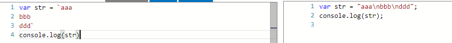
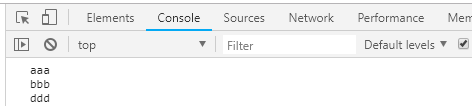

## 知识点

- ts介绍
    - 微软开发
    - JavaScript的超集（扩展了js的语法，以及基于类的面向对象编程的特性）
    - 遵循ES6

- 课程内容介绍
    - 优势
        - 支持ES6规范
        - 强大的IDE支持。（类型检查、语法提示<提高开发效率>、重构<提高开发效率和代码质量>）
        - Angular2的开发语言
    - 安装ts的开发环境
        - 什么是compiler?为什么需要compiler?
                - 安装ts的compiler(编译器)
        - 使用在线的compiler开发
        - 使用本地的compiler
    - ts概念、语法、特性
        - 字符串新特性
            - 多行字符串
                - 

                - 
            - 字符串模板
            - 自动拆分字符串
